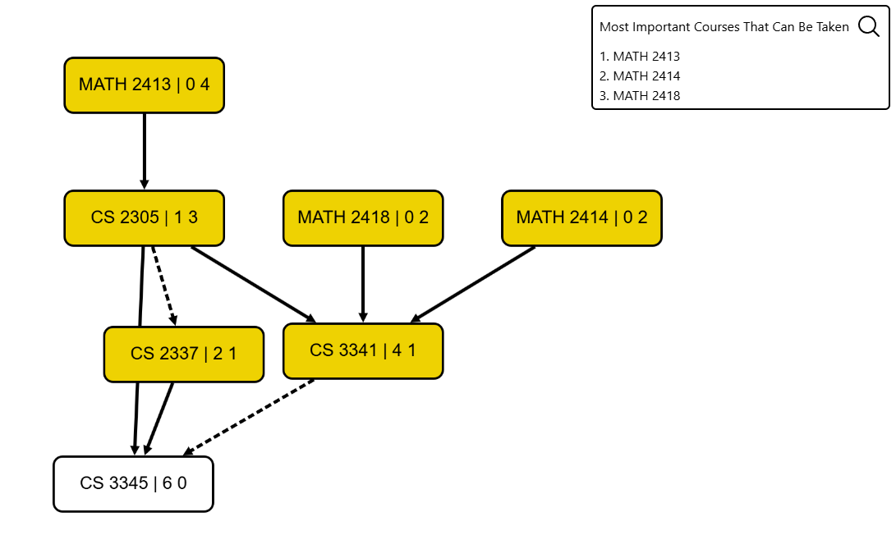

# UTD Degree Planner and Auditor

## Project Overview

### Participants

| Person  | Role | Job Description (Spring 2025) |
| ------------- | ------------- | - |
| Dr. Nandika D'Souza  | Project Sponsor  | Professor, Associate Dean of Strategic Initiatives, Jonsson School of Engineering and Computer Science at UTD |
| Daniel Nguyen  | Developer  | Student pursuing Bachelor of Science in Computer Science at UTD |
| Hayden Rogers  | Developer  | Student pursuing Bachelor of Science in Computer Science at UTD |

### Problems we are addressing

- Navigating degree requirements can be complex due to prerequisite chains, corequisite dependencies, and transfer credit evaluation, often leading to inefficient course planning, extended graduation timelines, and unnecessary coursework.
- Academic advisors must continuously update degree plans to reflect curriculum changes across different catalog years.
- Students need a way to track their degree progress and the ability to create plans that align with their current situation.
  - E.g. student who wants to graduate in the shortest amount of time but has to limit their hours for a certain semester. Which courses are most important?

### Solution\*

\*This list is not indicative of what has been implemented. Rather this list details what the overall application **should** do.

We design a web-based application that supports two main types of users: students and advisors.

#### Student View

- Ability to add courses from degree to degree plan
  - Sections include "Future" and all semesters (SPRING, SUMMER, FALL) from a student's indicated start semester to their indicated end semester
  - This function also involves "linking" a course to a specific block requirement.
- Ability to add and apply test and transfer credits to a student's degree plan
- Ability to see degree progress based on
  - Credits already received (courses from all semesters before current date's semester + applied test credits + applied transfer credits)
  - Credits planned (courses in "Future")
- Visual flowchart representation of requisite chains for a given degree plan
  - Please refer to [Documentation and Considerations](#documentation-and-considerations) for more information.
- Ability to view the most important courses for degree plan
  - Please refer to [Documentation and Considerations](#documentation-and-considerations) for more information.
- Ability to set restrictions on specific semesters
  - Limit number of hours
  - Lock in specific courses for a semester

#### Advisor View

- Ability to build degrees
  - Please refer to [Documentation and Considerations](#documentation-and-considerations) for more information.
- Ability to add and edit courses
- Ability to add and edit test and transfer credits

For a more in-depth look at our data representation and algorithms, please refer to our section on [Documentation and Considerations](#documentation-and-considerations).

### Developers' Comment

Given our work duration of ~12 weeks and that this is a new project, we hope to lay out a solid foundation and well-written documenation to give clear direction for the project. For continuing this project, we highly recommend reading through this README in its entirety, especially [Future Works and Considerations](#future-works-and-considerations) and [Documentation and Considerations](#documentation-and-considerations). Doing so will give a better idea of what has been implemented, what has been designed but not implemented, and what needs to be thought out.

### Future Works and Considerations

This list serves as our current considerations at this point in time.

#### High Priority Items

- Block Selection Logic
  - For a degree, there are branches that you can choose from. For example, you can choose one of either Math Sequences 1 or 2. Another example is from ATEC, where you can fulfill a block category this condition: "Choose five courses from at least two areas".
  - We need to support user preferences (when they lock in a specific course or branch to take). We also need to resolve ambiguous degree paths during our recommendations in the flowchart view when we list the most important classes.
    - A similar approach has already been taken with requisite selection logic for the flowchart.
- Semester Checking
  - When moving courses between planned, semesters, or test/transfer, we need to check to make sure that the course requisites are plausible.
    - For example, Operating Systems Concepts (CS 4348) should not be placed before its requisite, Data Structures (CS3345).
      - Note that this problem is exacerbated by the fact that requisites follow a boolean branching structure as well.
- Backwards compatibility (year-by-year) for courses, course requisites, and degree requirements
- Course hour splitting
  - Example 1: CS degree footnote states *"3. Three semester credit hours of Calculus are counted under Mathematics Core, and five semester credit hours of Calculus are counted as Component Area Option Core."*
  - Example 2: Substitution for CS lab. Since the lab is 1 credit hour, a user can substitute a 4-hour course and use the remaining 3 hours as free elective credit.
- Overrides and substitutions
  - Our design cannot handle all every cases and thus there is a need to allow carefully designed functionality to override/bypass degree requirements. However, great care must be taken to ensure this is not the most common and obvious operation in the context of the application.
- Implement Matcher and Flag blocks
  - Matcher blocks are meant to match to a specific core curriculum, a list of classes, or a specific prefix or course level.
  - Flag blocks are meant as a catch-all way to add conditionals to a degree plan.
    - For example, there are cases where block selection changes depending on a condition we cannot generally track. For example, taking a specific number of hours for a block could depend on taking more or less hours for Math Sequence.
    - Another example is a course requirement for specific circumstances (i.e. transfer student sometimes do not need to take an introductory freshman course like UNIV 1100)
- Degree Validation Logic
  - Progress Bar
  - Fulfill block conditions (based on planner + preferences)
- Course requisite editor on Build Course page

#### Medium Priority Items

- Requisite Preferences
- Figure out how to properly sync data, whether through UTD systems, web scraping, or periodic maintenance.
- Clean out all TODO in the code by either resolving them or deleting them if too old/irrelevant.
- Consideration for database update/deletion cascade. (ex. how does removing a course from a degree affect every degree plan with that course and degree?)
  - Ideally, degrees should not be "hard" editable after an advisor creates and submits them. This means the overall structure and block conditions should not change. However, a degree should be "soft" editable, where changing a text field or footnote does not affect students' degree plans.
- Implement test credit AND/OR parsing.
  - A specific AP credit that gives you an option to take a certain set of courses as credit is AP Mathematics: Calculus BC. Our parsing only assumes that credit is given as a comma-separated list.
- Combining multiple majors/minors/certifications into a single degree plan
- Extend application to handle multiple degree plans
- Proper account management and authentication (not UTD SSO since prospective students like seniors in high school should be able to use the application too)
  - Tools like Firebase Authentication can work.
- Consider if test/transfer credits should be defined per user or per user's degree plans
- Extend logic to allow planning transfer credit classes for a specific semester
  - For example, a course at Dallas College could be placed in a future semester.
- Implement proper and useful error handling via Prisma codes to both the frontend and backend.
- Implement degree footnotes

#### Low Priority Items and Other Considerations

- Deciding to switch to a fully relational database structure.
  - Currently, we mix JSON into the SQLite database for ease of development. For example, course requisites are defined as a JSON format. This has the benefit that TS objects can be easily typed and parsing through a structured JSON is simpler. However, developers may find the need to convert to a fully relational database structure.
- Usage of AI/ML such as chatbots?
  - Although our application should not be a ground truth for advising questions, it should serve as a very accurate and helpful tool to plan for your degree. Given the development of AI chatbots, integrating one could be useful. However, we must carefully research the needs it would be fulfilling that are not already being fulfilled programmatically by our logic. Additionally, safeguards must be in place to prevent chatbot misuse, hallucinations, etc.
    - Overall, a chatbot integration is well outside the scope of the project until all core features are refined and polished. We believe that there is not much of a need to implement a chatbot that doesn't outweigh the time and cost needed.
    - If a chatbot is desired, consider techniques such as Retrieval-Augmented-Generation and Knowledge Graphs to supplement chatbot responses.

## Tech Stack

- **Frontend:** React.js
- **Backend:** Express.js
- **Database:** SQLite with Prisma ORM
- **Version Control:** Git/Github
- **Cloud Deployment:** AWS

## Developer Setup

### Setting Up Development Environment (local)

Ensure Node.js, npm, Visual Studio Code, Git are installed. Ensure that everyone is working on the latest Long-Term-Support (LTS) Node.js version.

Usually, you can get away with using Git Bash (on its own or within VS Code) as your terminal.

#### Install the repo

```bash
git clone https://github.com/CrazEpic/UTD-Degree-Planner-and-Auditor.git
cd UTD-Degree-Planner-and-Auditor
npm install
```

#### Set up environment variables

```bash
# Fill out the environment variables accordingly
cp .env.example .env
```

#### Database Setup

```bash
# Initialize the database and test data seeding
npx prisma migrate dev --name init
```

#### Running the Application

```bash
npm run dev
```

#### Useful Dev Tips

##### Prettier Formatting

```bash
npm run format
```

##### Prisma

```bash
# Prisma GUI to view database
npx prisma studio
```

##### Postman

Use Postman to test HTTP, SSE, and WebSockets. Keep in mind that some features like SSE do not work on the Postman extension for VSCode, so have the Postman desktop app for full functionality.

### Deploying the Application (AWS EC2)*

*This is a test setup for now. There is probably a more efficient and secure way to do this. We have to manually set up the SQLite database locally since the database seeding needs more than 1 GB of ram.

#### AWS EC2 Details

- **Amazon Machine Image (AMI):** Amazon Linux 2023 AMI
- **Instance Type:** t2.micro

#### Local Building

```bash
git clone https://github.com/CrazEpic/UTD-Degree-Planner-and-Auditor.git
cd UTD-Degree-Planner-and-Auditor
npm install
cp .env.example .env
# Set up the database locally
npx prisma migrate dev --name init
```

Make sure to zip UTD-Degree-Planner-and-Auditor in order to copy UTD-Degree-Planner-and-Auditor.zip to AWS.

#### Copy and Setup on AWS

Remember to setup the security group to allow traffic from TCP Port 3000. Additionally, allow traffic from HTTP/HTTPS.

```bash
# Copy the zip file to the EC2 instance
scp -i ./YOUR_KEY.pem /path/to/UTD-Degree-Planner-and-Auditor.zip ec2-user@AWS_PUBLIC_IPV4_DNS:/home/ec2-user/
# SSH into the EC2 instance
ssh -i "YOUR_KEY.pem" ec2-user@AWS_PUBLIC_IPV4_DNS
# Install NVM and Node.js (LTS version)
curl -o- https://raw.githubusercontent.com/nvm-sh/nvm/v0.39.7/install.sh | bash
source ~/.bashrc
nvm install --lts
# Unzip the project and set it up
unzip UTD-Degree-Planner-and-Auditor.zip
rm UTD-Degree-Planner-and-Auditor.zip
cd UTD-Degree-Planner-and-Auditor
# Clean install
rm -rf node_modules/ package-lock.json
npm install
# Run the production build
npm run prod
```

## Documentation and Considerations

### Swagger UI API Documentation

Swagger is used to document all APIs. To keep DRY principles as much as possible, we utilize generated documentation as much as possible. The generation happens in these steps:

1. [./prisma/schema.prisma](./prisma/schema.prisma) contains a generator "prisma-json-schema-generator" that is configured to output scalar fields (not relations) for each table to a JSON format in [./prisma/json-schema/json-schema.json](./prisma/json-schema/json-schema.json).
2. [./prisma/zod-objects.ts](./prisma/zod-objects.ts) will compile the JSON into zod objects in [./prisma/json-schema/prisma-zod-objects.ts](./prisma/json-schema/prisma-zod-objects.ts).
3. [./src/server/routes/routeSchema.ts](./src/server/routes/routeSchema.ts) will utilize these Prisma zod objects as response templates when needed. Request templates are defined within the file itself and are also used across the routes as input validation.
   - @asteasolutions/zod-to-openapi is used to connect zod objects with OpenAPI json format.

Therefore, when modifying APIs, we strongly advise checking the corresponding path registration and request input template located in [./src/server/routes/routeSchema.ts](./src/server/routes/routeSchema.ts).

To update the Swagger documentation

```bash
npm run prisma-zod
```

To view the Swagger UI

```bash
npm run dev
Go to http://localhost:5173/api-docs
```

### UI/UX Key Considerations

#### Mobile Friendly Design

- We design our application such that users can view it on various screen sizes from mobile browsers to computers. Utilize responsive design through media queries.

#### Drag and Drop?

- We decided that implementing "Drag and Drop" functionality would be a UI/UX enhancement. However, it is well outside our scope. Furthermore, great care must be taken to ensure that the website is still usuable through button functionality for keyboard accessiblity reasons.

### Data Representation Key Considerations

#### Representation of Degrees

After weeks of researching, we have come up with a degree structure that should be general enough to handle most of UTD's degrees.

Degrees are represented as nested blocks. A block can either be nonterminal (meaning it should map to another block) or terminal (meaning it doesn't map to another block).

Nonterminal blocks are able to have conditions applied to them. The idea is to be able to build combinations of conditions together to handle block requirements. 

For example, MATH Sequence - Students may choose one of the following sequences:

- I. MATH 2413 Differential Calculus and MATH 2414 Integral Calculus
- II. MATH 2417 Calculus I and MATH 2419 Calculus II

We represent this Math Sequence in our model with a block to represent the choice between sequences and have each sequence nested insde as its own block as well. To create the OR functionality between the sequences we use the BlockFulfillmentCondition and set the value of blocksToFulfill to 1.

Below is the type file for block conditions

```ts
type BlockFulfillmentCondition = {
 blocksToFulfill: number
}

type MinBlockInclusionCondition = {
 minBlocksToInclude: number
}

type CreditHourCondition = {
 minCreditHours: number
}

type LevelCondition = {
 creditHourRequirement: number
 level: CourseLevel
}

type HourBeyondBlockCondition = {
 blockKey: string
 hoursBeyondBlock: number
}

export type DegreeConditions = {
 blockFulfillmentCondition?: BlockFulfillmentCondition
 minBlockInclusionCondition?: MinBlockInclusionCondition
 creditHourCondition?: CreditHourCondition
 levelCondition?: LevelCondition
 hourBeyondBlockCondition?: HourBeyondBlockCondition
}
```

A more complex example, ATEC Prescribed Electives

15 semester credit hours; Choose any five courses from the following. At least two courses must be at the 4000-level, and the courses must come from at least two of the categories. Category List: (Animation and Games, Critical Media Studies, Design, Emerging Communication, Emerging Media Art)

Prescribed Electives would be a block with the CreditHourCondition of 15 hours, a LevelCondition of 4000 level and 6 credit hours required, and a MinBlockInclusionCondition of 2. Then nested within the Prescribed Electives block, there will be a block to represent each category. These blocks will be terminal and contain a list of courses pertaining to that category.

Blocks that are terminal are currently of two types: course and text. These simply represent a course or helper text respectively.

Here is the current type file we are using for the block structure.

```ts
import { Course, Degree } from "./degree"

export type NonTerminalBlock = {
 id: string
 conditions: object
}

export type CourseBlock = {
 id: string
 Block: BlockRequirement
 Course: Course
 prefix: string
 number: string
}

export type TextBlock = {
 id: string
 text: string
}

export type MatcherGroupBlock = {
 id: string
 matcher: string // JSON?
}

export type FlagToggleBlock = {
 id: string
 flag: DegreeFlag
 flagId: string
}

export type DegreeFlag = {
 id: string
 flag: string
 toggles: FlagToggleBlock[]
}

export type Block = {
 blockID: string
 blockName: string
 parentBlockID: string
 blockPosition: number
 innerBlocks: Block[]
 blockType: string
 blockContent: NonTerminalBlock | CourseBlock | TextBlock | MatcherGroupBlock | FlagToggleBlock
}

export type BlockRequirement = {
 blockID: string
 blockName: string
 parentBlockID?: string
 ParentBlock?: BlockRequirement
 InnerBlocks: BlockRequirement[]

 // TODO: use lexoranking for ordering
 blockPosition: number

 // PLEASE ONLY USE ONE AND ONLY ONE OF THE BLOCKS BELOW
 NonterminalBlock?: NonTerminalBlock
 CourseBlock?: CourseBlock
 TextBlock?: TextBlock
 MatcherGroupBlock?: MatcherGroupBlock
 FlagToggleBlock?: FlagToggleBlock

 // should only be true for the root block
 Degree?: Degree

```

#### Representation of Course Requisites

Course requisites are represented as a tree of boolean expressions (AND/OR) of clauses. There is a balance of requistes we can and cannot represent and track logically. For example, we can logically represent courses, majors, minors, and groups of courses (matcher). However, there are requisites that cannot be tracked. For example, requisites such as "Instructor Consent Required" and "requires working knowledge of X" should be handled by the user.

Below is the TypeScript type definition we used.

```ts
export type CourseLevel = "1000" | "2000" | "3000" | "4000" | "UPPER_DIVISION"

// match a list of predefined courses, or a core curriculum area, with prefix/level as optional conditions
type MatcherRequisite = {
  type: "matcher"
  matchList?: string[] | string
  condition: {
    prefix?: string
    level?: CourseLevel
    minGrade?: string
    minCreditHours?: number
  }
}

export type CourseRequisite = {
  type: "course"
  courseID: string
  minGrade?: string
}

type MajorRequisite = {
  type: "major"
  major: string
}

type MinorRequisite = {
  type: "minor"
  minor: string
}

export type CustomRequisite = {
  type: "custom"
  text: string
}

export type Requisite = MatcherRequisite | CourseRequisite | MajorRequisite | MinorRequisite | CustomRequisite

type RequisiteGroup = {
  logicalOperator: "AND" | "OR"
  requisites: RequisiteGroup[] | [Requisite]
}

export type Requisites = {
  prerequisites: RequisiteGroup
  corequisites: RequisiteGroup
  prerequisitesOrCorequisites: RequisiteGroup
}
```

#### Web Scraping

For the purposes of obtaining development data, [this Jupyter notebook](./webscrape/scrap.ipynb) shows the process of parsing through UTD's course requisites, test credits, and transfer credits. Do note that there may be inaccuracies due to simplifications in regex parsing. Therefore, when publishing the application for real-world use, it would be best to manually input all courses (test/transfer credits could be automated since their representations are more structured). This comes at a high initial effort cost. However, afterwards the maintenance cost becomes yearly. Since this application is not directly synced to UTD's data systems, this would be the best way to ensure consistency between UTD's data and our application's data.

### Algorithms Key Considerations

#### Algorithm to Generate Requisite Flowchart

##### Resolving Course Selection Ambiguity

To generate the requisite flowchart, all ambiguity in course selection must be resolved.

This represents a high-level pseudocode of the intended steps for course selection resolution.

```text
Get all courses with credit received
Get all future courses in planner
Resolve all block ambiguity in the planner
-> Get all courses in the degree
Fulfill all requisites to the best of your ability
While unresolved requisites
 Resolve all ambiguous requisites
 Fetch all missing requisite courses if needed
```

##### Heuristic for Calculating Class Priority

We use [Cytoscape.js](https://js.cytoscape.org/) both for visualization and graph operations as this simplifies a majority of the graph operations we need.

Steps

1. Find the course with the most incoming predecessor edges (progate edges forward). Call this your critical course.
2. Find the courses that you can currently take (root nodes) that are predecessors of your critical course.
3. Of the valid root nodes you found, list the course with the broadest edge contributions (most number of successer nodes).

Here is an example of the generated flowchart. The left number represents the node's number of predecessors and the right number represent the node's number of successors. The yellow nodes are the temporarily added courses from requisite selection. The white nodes are the current courses in the planner.


